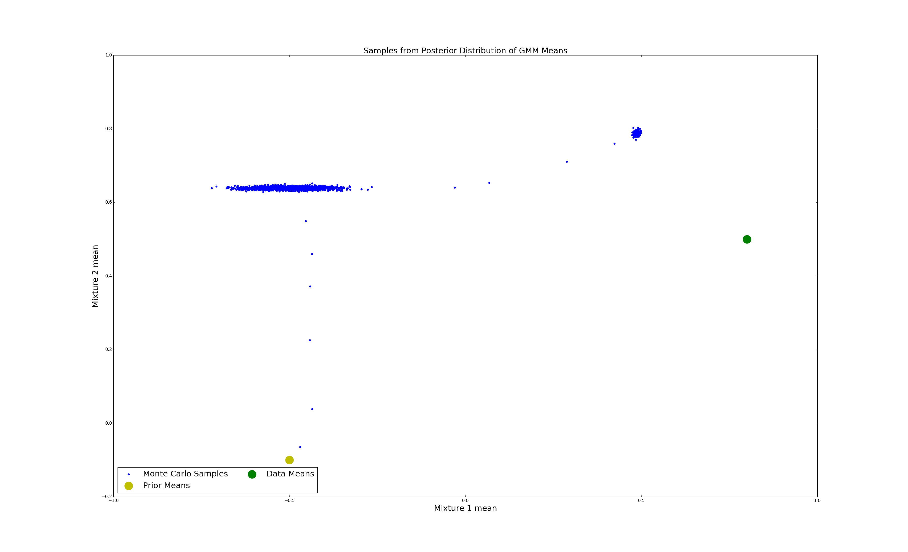

Examples
========

A Simple 2-D Example
--------------------

First import the relevant classes.

.. code-block:: python

    import gmmmc
    from gmmmc.priors import MeansUniformPrior, CovarsStaticPrior, WeightsStaticPrior, GMMPrior, MeansGaussianPrior
    from gmmmc.proposals import GMMBlockMetropolisProposal, GaussianStepCovarProposal, GaussianStepWeightsProposal, GaussianStepMeansProposal
    from gmmmc import MarkovChain
    import logging
    import matplotlib.pyplot as plt

Enable the viewing of the gmmmc logging output

.. code-block:: python

    logging.getLogger().setLevel(logging.INFO)

Lets first generate some data. Here we can pick some parameters for a 2-mixture 1 dimensional GMM.

.. code-block:: python

    np.random.seed(3)
    covars = np.array([[0.01], [0.01]])
    weights = np.array([0.5, 0.5])
    data_means = np.array([[0.8], [0.5]])
    data_gmm = gmmmc.GMM(data_means, covars, weights)

    artificial_data = data_gmm.sample(1000) # call the sampling function to draw samples from the GMM

In this example, we will search only the parameter space of the means. The covariances and weights are given static
values by using the CovarsStaticPrior and WeightsStaticPrior objects respectively. Give the means a gaussian prior,
each mixture mean vector is assumed to have a multivariate gaussian prior centered at the corresponding mean vector
in prior_means and covariance given by the corresponding (diagonal) covariance in covars/2.

.. code-block:: python

    prior_means = np.array([[-0.5], [-0.1]])

    prior = GMMPrior(MeansGaussianPrior(prior_means, covars/2),
                     CovarsStaticPrior(covars),
                     WeightsStaticPrior(weights))

Set a proposal function. Currently only one proposal function (that is of any use for GMMs) has been implemented.
This is the blocked metropolis proposal. It works by using separate proposal functions for each of the means, covariances
and weights. In this case since only the means are to be varied, propose_mean is set to a GaussianStepMeansProposal
while the other proposal functions are left as None.

The GaussianStepMeansProposal works again in blocks. For each mixture, a new mean vector is proposed by sampling
from a multivariate gaussian centered at the current mixture mean. The number of steps to take and the covariance of this
gaussian proposal distribution (values along the diagonal) is set by an array of step_sizes. The acceptance
probability is calculated as in regular metropolis hastings.

.. code-block:: python

    proposal = GMMBlockMetropolisProposal(propose_mean=GaussianStepMeansProposal(step_sizes=[0.0003, 0.001]),
                                          propose_covars=None,
                                          propose_weights=None)

The base algorithm to be used is Markov Chain Monte Carlo. This algorithm explores the state space using a proposal
function. In our case this is the blocked metropolis hastings proposal outlined above. This algorithm requires a starting
GMM which we will set with the prior parameters. The algorithm object itself is initialised with the proposal, prior
and initial_gmm objects.

.. code-block:: python

    initial_gmm = gmmmc.GMM(prior_means, covars, weights)
    mcmc = MarkovChain(proposal, prior, initial_gmm)

To run the sampling process simply call the sample() method. Here we have set the sampler to produce
20000 monte carlo samples using the artificial data as the as the model data. n_jobs can be set to the number
of cpus to be used. Setting n_jobs to -1 will use all available cpus.

.. code-block:: python

    samples = mcmc.sample(artificial_data, 20000, n_jobs=-1)

We can check the acceptance rate for the means proposal function by accessing the stored proposal object
propose_mean and calling its get_acceptance() method. This returns an array of acceptance rates, each corresponding
to the covariances in the step_sizes argument in the proposal function constructor. An acceptance rate of ~35% is
usually desirable but lower acceptance rates are acceptable if big step sizes are required for good mixing.

.. code-block:: python

    print proposal.propose_mean.get_acceptance()

We can plot and visualise the samples of the monte carlo sampler relative to the prior and data means.
Note that most of the monte carlo samples are clustered around two areas. These represent the different modes of the
distribution.

mc_means = [[s.means[0][0], s.means[1][0]] for s in samples[::10]]
mc_means = np.array(mc_means)

mcmc = plt.scatter(mc_means[:,0], mc_means[:,1], color= 'b')
true = plt.scatter(data_means[0][0], data_means[1][0], color='g', s=500)
prior = plt.scatter(prior_means[0][0], prior_means[1][0], color= 'y', s=500)
plt.title('Samples from Posterior Distribution of GMM Means', fontsize=22)
plt.xlabel('Mixture 1 mean', fontsize=22)
plt.ylabel('Mixture 2 mean', fontsize=22)

plt.legend((mcmc, prior, true),
           ('Monte Carlo Samples', 'Prior Means', 'Data Means'),
           scatterpoints=1,
           loc='lower left',
           ncol=2,
           fontsize=22)

plt.show()

